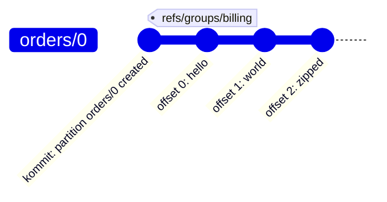
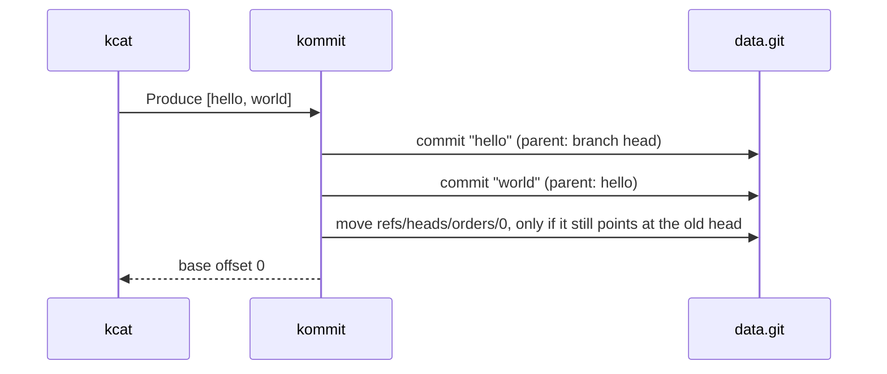

# kommit

[](https://github.com/santimillang/kommit/actions/workflows/ci.yml)
[](LICENSE)

**Kafka, except every record is a Git commit.**

kommit is a single Kafka broker written in Rust whose only storage is a Git
repository. Point Kafka clients at it (`kcat`, librdkafka, and Kafka's own Java
console tools are tested in CI) and they just see a broker. Underneath, your
topic is a branch, every message is a commit, and `git log` is a consumer.

It is a joke. It also passes `git fsck --strict`.

## The mapping

| Kafka | Git |
|---|---|
| record | commit: the value is the message, key and headers are commit headers |
| partition | branch `refs/heads/<topic>/<partition>` |
| offset *k* | the *k+1*-th commit on that branch (after a sentinel root) |
| produce | write the commits, then one compare-and-swap ref update |
| consumer group offset | ref `refs/groups/<group>/<topic>/<partition>`, trailing the branch |
| consumer lag | `git rev-list --count <group ref>..<branch>`. Really. |
| cluster metadata | a commit log at `refs/kommit/meta`, like KRaft |
| retention | none. Git never forgets. |

A partition, as Git sees it, with the `billing` group two records behind:



```console
$ git rev-list --count refs/groups/billing/orders/0..orders/0
2
```

And what happens when you produce:



The ref move is the commit point. Crash before it, and consumers never see a
half-written batch, just some dangling objects for `git gc`.

## Try it

```bash
cargo run -- --data demo.git --listen 127.0.0.1:9092 --advertised-host 127.0.0.1

printf 'hello\nworld\n' | kcat -b 127.0.0.1:9092 -P -t orders
kcat -b 127.0.0.1:9092 -G billing -X auto.offset.reset=earliest -c 2 orders

git --git-dir demo.git log --oneline orders/0                      # consume, but make it Git
git --git-dir demo.git rev-list --count refs/groups/billing/orders/0..orders/0   # lag
git --git-dir demo.git push --all <your-remote>                    # your topics, now on GitHub
```

## Things you can now do to a message queue

- `git log` your event stream, with the producer's client id as the author
- `git fsck` as your data-integrity check
- `git push` to replicate, after a fashion
- Every record has a SHA, so history is tamper-evident

## Status

| Milestone | What | |
|---|---|---|
| M1 | Produce, Fetch (long polling), Metadata, CreateTopics, ListOffsets, ApiVersions | done |
| M2 | Consumer groups (classic protocol), committed offsets as refs, idempotent producers | done |
| M3 | Topic branching: fork a topic at an offset with `git branch`, zero copy | next |

Single broker, plaintext only, no transactions, no durability guarantees, no retention.
Please do not put it in production. It will let you, and it will work.

Design notes: [`docs/superpowers/specs/2026-10-02-kommit-design.md`](docs/superpowers/specs/2026-10-02-kommit-design.md).

## License

[Apache-2.0](LICENSE)
